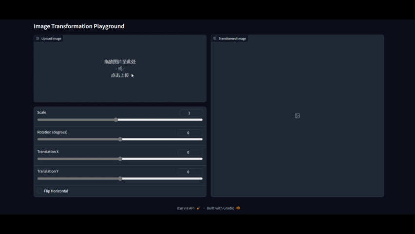
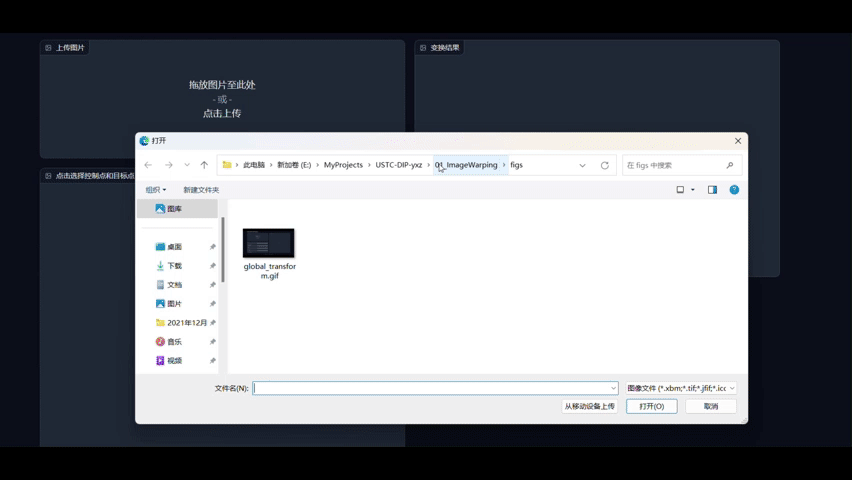

# 01 Image Warping

> 本仓库是中国科学技术大学2024年秋季学期数字图像处理（MATH6420P.01）的课程作业，拥有者为杨萱泽。

本实验实现了：
- 图像的基本变化。包括图像的伸缩、旋转、平移、镜像等；
- 图像的交互变形。具体实现使用了移动最小二乘方法（Moving Least Squares, MLS）[^1].

## 环境依赖

### 创建并激活虚拟环境

在当前目录终端中运行：

```bash
python -m venv env-01
```

在 `Linux` 系统中，运行：

```bash
source env-01/bin/activate
```

在 `Windows` 系统中，运行：

```bash
.\env-01\Scripts\activate
```

```bash
pip install -r requirements.txt
```

### 安装环境依赖

在终端中运行

```bash
pip install -r requirements.txt
```

## 运行方法及结果

在当前目录下运行

```bash
cd source
```

输入如下命令，运行图像的基本几何变化：

```bash
python run_global_transform.py
```

运行结果示例如下：

<div  align="center">    
    
</div>

输入如下命令，运行基于点的图像变形：

```bash
python run_point_transform.py
```

运行结果示例如下：

<div  align="center">    
    
</div>

------------------

[返回根目录文档](../README.md)

[^1]: https://people.engr.tamu.edu/schaefer/research/mls.pdf