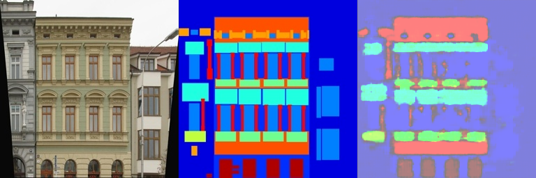

<head>
<meta charset="UTF-8">
<title>并排图片示例</title>
<style>
  .image-container {
    display: flex; /* 使用flex布局 */
    justify-content: center; /* 水平居中 */
    align-items: center; /* 垂直居中 */
  }
  .image-container img {
    width: 30%; /* 每张图片宽度为容器的30% */
    margin: 10px; /* 图片之间的间距 */
  }
</style>
</head>

# 02 DIP with PyTorch

> 本仓库是中国科学技术大学2024年秋季学期数字图像处理（MATH6420P.01）的课程作业，拥有者为杨萱泽。

本实验实现了：
- 基于优化的Poisson图像融合
- 基于Pix2pix的图像语义分割

## 环境依赖

### 创建并激活虚拟环境

在当前目录终端中运行

```bash
python -m venv env-02
```

在`Linux`系统中，运行：
```bash
source env-02/bin/activate
```

在`Windows`系统中，运行：
```bash
.\env-02\Scripts\activate
```

### 安装环境依赖

在终端中运行

```bash
pip install -r requirements.txt
```

即可安装本实验所需要的第三方库。

## 运行方法及结果

### Poisson Blending

在当前目录终端中运行

```bash
cd PoissonBlend/source
```

输入

```bash
python run_blending_gradio.py
```

选择前景和背景图片，使用鼠标左键进行多边形选择，然后点击`Blend`按钮，即可执行Poisson Blending。运行结果如下图所示

<div class="image-container">
    
    
    
</div>

### Pix2pix

在当前目录终端中运行

```bash
cd Pix2pix
```

然后运行脚本下载数据集

```bash
bash download_facades_dataset.sh
```

最后运行脚本开始训练

```bash
python train.py
```

训练400轮后验证集上的结果如下：

<div align="center">
    
    
    
    
    
</div>

[返回根目录文档](../README.md)
