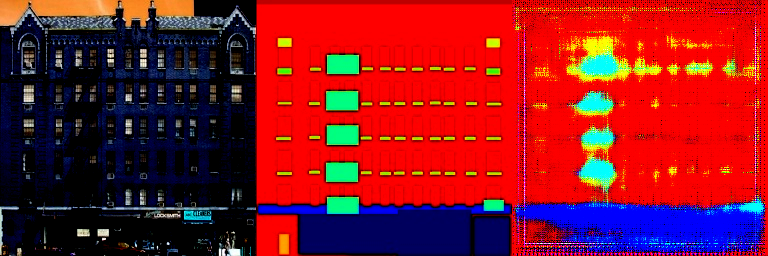
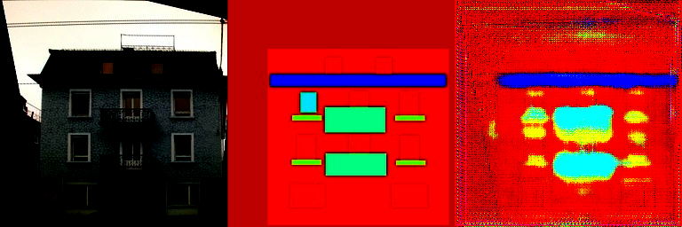
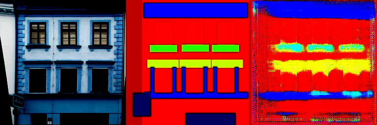
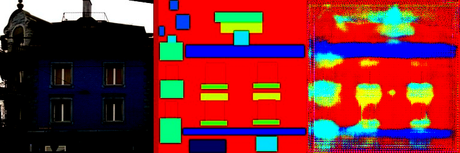

# 基于 Pix2Pix + GAN 的图像语义分割

本实验将 Pix2Pix 和 GAN 结合，实现了图像的语义分割。

## 实现细节

### 网络结构

仿照 GAN 的思路，实验中用到的网络的主要结构有：
- 判别器
  - 由两个下采样层、两个卷积层和一个批量归一化层组成
- 生成器
  - 由六个下采样层、六个上采样层和最终的输出层组成

#### 判别器

判别器中，输入的图像被分为语义分割图和原图，分别通过两个下采样层，然后拼接在一起，再通过一个卷积层、一个批量归一化层和一个 Leaky ReLU 激活函数，最后通过一个卷积层和自适应平均池化层得到最终的输出。

核心代码如下：
```python
class Discriminator(nn.Module):
    def __init__(self):
        super(Discriminator, self).__init__()
        self.downSampleLayers = nn.Sequential(
            DownSampleLayer(6, 32),
            DownSampleLayer(32, 64),
        )
        self.conv1 = nn.Conv2d(64, 128, kernel_size=3)
        self.bn = nn.BatchNorm2d(128)
        self.last = nn.Conv2d(128, 1, kernel_size=3)

    def forward(self, anno, img):
        x = torch.cat([anno, img], dim=1)
        x = self.downSampleLayers(x)
        x = F.dropout2d(self.bn(F.leaky_relu_(self.conv1(x))))
        x = self.last(x)
        x = F.adaptive_avg_pool2d(x, (1, 1))
        x = torch.flatten(x, 1)
        return torch.sigmoid(x)
```

#### 生成器

生成器中，输入的图像通过六个下采样层，然后通过一个中间层，最后通过六个上采样层得到最终的输出。这里使用了 U-Net 的结构，即每个下采样层和其对应的上一层的输出被拼接在一起，作为下一个下采样层的输入。

核心代码如下：
```python
class Generator(nn.Module):
    def __init__(self):
        super(Generator, self).__init__()
        self.down_sample_layer_1 = DownSampleLayer(3, 64)
        self.down_sample_layer_2 = DownSampleLayer(64, 128)
        self.down_sample_layer_3 = DownSampleLayer(128, 256)
        self.down_sample_layer_4 = DownSampleLayer(256, 256)
        self.down_sample_layer_5 = DownSampleLayer(256, 256)
        self.down_sample_layer_6 = DownSampleLayer(256, 256)
        self.bottle_neck = DownSampleLayer(256, 256)
        self.up_sample_layer_1 = UpSampleLayer(256, 256)
        self.up_sample_layer_2 = UpSampleLayer(512, 256)
        self.up_sample_layer_3 = UpSampleLayer(512, 256)
        self.up_sample_layer_4 = UpSampleLayer(512, 128)
        self.up_sample_layer_5 = UpSampleLayer(384, 64)
        self.up_sample_layer_6 = UpSampleLayer(192, 64)
        self.final_layer = nn.ConvTranspose2d(128, 3, kernel_size=4, stride=2, padding=1)

    def forward(self, x):
        x1 = self.down_sample_layer_1(x)
        x2 = self.down_sample_layer_2(x1)
        x3 = self.down_sample_layer_3(x2)
        x4 = self.down_sample_layer_4(x3)
        x5 = self.down_sample_layer_5(x4)
        x6 = self.down_sample_layer_6(x5)
        bottleneck = self.bottle_neck(x6)
        u1 = self.up_sample_layer_1(bottleneck)
        u2 = self.up_sample_layer_2(torch.cat([u1, x6], dim=1))
        u3 = self.up_sample_layer_3(torch.cat([u2, x5], dim=1))
        u4 = self.up_sample_layer_4(torch.cat([u3, x4], dim=1))
        u5 = self.up_sample_layer_5(torch.cat([u4, x3], dim=1))
        u6 = self.up_sample_layer_6(torch.cat([u5, x2], dim=1))
        out = self.final_layer(torch.cat([u6, x1], dim=1))
        return torch.tanh(out)
```

### 训练参数

训练时，生成器和判别器的学习率均为 1e-3，权重衰减为 1e-5，betas 使用 (0.5, 0.999)，使用 Adam 优化器。

训练时的 batch size 为 256，训练 500 个 epoch。

生成器和判别器的学习率调度器均为 StepLR，每 100 个 epoch 将学习率乘以 0.5。

### 实验数据集

实验中使用的数据集为 facades，数据集的下载脚本在 [download_dataset.sh](download_dataset.sh) 中。

## 实现效果

训练 500 个 epoch 后，语义分割结果如下所示：
<div align="center">
    
    
    
    
</div>

[返回根目录文档](../README.md)